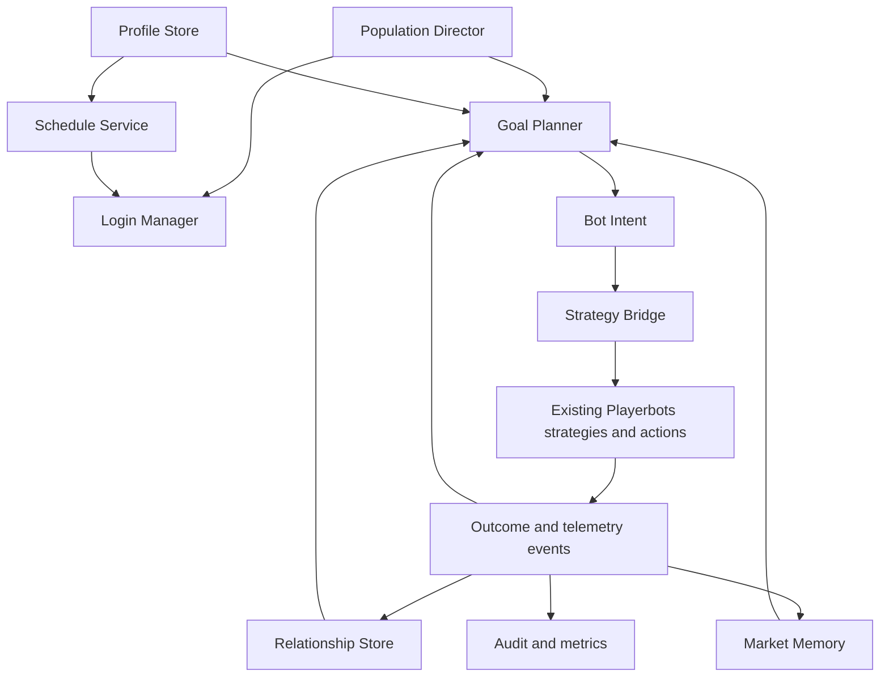
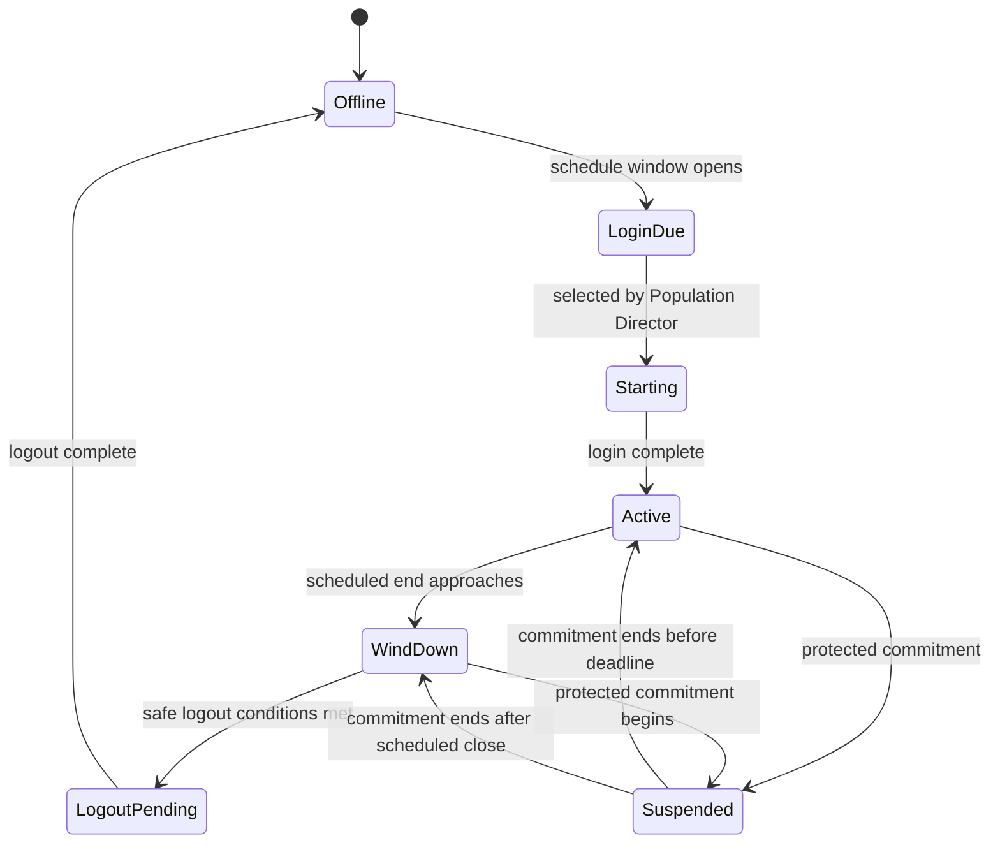
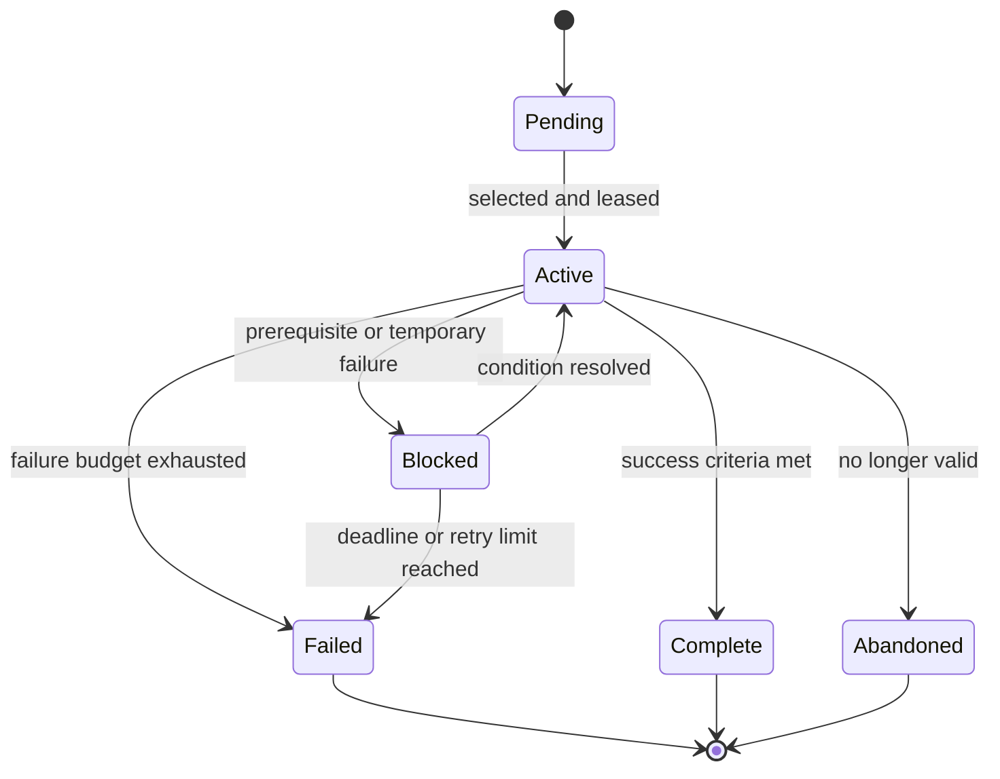

# Living Realm: Persistent Playerbot Population Simulation

- **Status:** Draft
- **Target:** CMaNGOS Playerbots, Classic-first
- **Compatibility goal:** Preserve TBC and WotLK build compatibility where practical
- **Document version:** 0.1
- **Last updated:** 2026-07-13
- **Upstream baseline reviewed:** `cmangos/playerbots@92f12098dc8c5c25ef268f89cac0f43c6ca55d4b`

## 1. Summary

Playerbots already provides a capable execution engine for class combat, questing,
travel, vendors, trainers, mail, banks, the Auction House, groups, guilds,
battlegrounds, and player-controlled alternate characters. What it does not yet
provide is a coherent, persistent model of a realm population: individual bots do
not have durable schedules, long-lived goals, stable personalities, meaningful
relationships, or an economy strategy that persists across sessions.

This design introduces an optional **Living Realm** layer above the existing
strategy, trigger, action, and value system. The layer decides *who a bot is*,
*when it should play*, *what it is trying to achieve*, and *which existing
Playerbots strategies should execute that intent*. Existing combat and moment-to-
moment gameplay remain authoritative.

The first supported profile is **Organic Realm**:

- every random bot starts at the core's normal starting level;
- levels, gold, equipment, skills, reputation, and quest progress are earned via
  normal game mechanics;
- schedules and goals survive logout and server restart;
- routine random level, gear, money, and location fabrication is disabled;
- unavoidable synthetic recovery actions are explicit, bounded, and audited;
- offline bots do not gain material progression;
- LLMs are never authoritative for gameplay decisions.

The feature is disabled by default. A disabled installation must retain current
Playerbots behavior and database compatibility.

## 2. Motivation

The current random-bot system is effective at making the world populated and at
providing competent companions. It also necessarily uses shortcuts such as
randomized levels, generated equipment, periodic relocation, and probabilistic
activity changes. Those shortcuts are useful for a general-purpose server but
weaken the illusion of a persistent single-player MMO realm.

For a Living Realm, a character should remain recognizable over time:

- a level 12 miner should still be the same miner tomorrow;
- a bot that began a quest chain should resume it after logging in again;
- a tank and healer who repeatedly succeed together should prefer one another;
- a crafter should remember prices and gather materials for a specific recipe;
- a bot should finish an activity and travel somewhere safe before logging out;
- the population should change with time of day without despawning committed
  party members;
- the realm should be able to explain every non-gameplay mutation to character
  state.

The proposed layer supplies that continuity without replacing the mature
Playerbots execution engine.

## 3. Goals

### 3.1 Product goals

1. Support a convincing private "single-player MMO" experience with a persistent
   artificial population.
2. Allow all random bots to begin at level 1 and progress organically.
3. Give every bot a stable profile, schedule, current goal, and history.
4. Preserve commitments to real players, groups, instances, and battlegrounds.
5. Improve realm-wide population, role, zone, and queue health without changing
   character levels or inventing equipment.
6. Make Auction House and profession behavior persistent and economically
   explainable.
7. Enable durable social relationships, preferred groups, and guild identities.
8. Provide data-driven dungeon and raid mechanics incrementally.
9. Make behavior observable, reproducible, testable, and safe to disable.
10. Keep the implementation primarily inside the Playerbots module and minimize
    required changes to CMaNGOS cores.

### 3.2 Engineering goals

1. Do not block the world update loop on database or network I/O.
2. Make all planner transitions idempotent and restart-safe.
3. Bound CPU, memory, database writes, relationship cardinality, and external
   requests.
4. Reuse existing strategies and actions rather than duplicating combat,
   movement, quest, vendor, mail, or Auction House logic.
5. Preserve Classic, TBC, and WotLK compilation through explicit expansion
   guards where functionality differs.
6. Provide deterministic test modes through stable seeds and simulated clocks.

## 4. Non-goals

The initial implementation will not:

- attempt to make bots indistinguishable from human players;
- use an LLM for combat, movement, spending, inventory, quest, or group authority;
- grant offline experience, loot, money, skill, or reputation in Organic Realm;
- eliminate every emergency teleport before the feature can ship;
- provide complete scripted coverage for every Vanilla raid in the first release;
- replace CMaNGOS pathfinding, quest scripts, combat handlers, or persistence;
- provide a public remote-control API;
- change normal faction, class, race, lockout, loot, or eligibility rules;
- require Living Realm tables or services when the feature is disabled.

A future explicitly separate simulation profile may support coarse offline
progression. It is outside this design because it weakens the auditability and
meaning of organic progression.

## 5. Design principles

### 5.1 Existing Playerbots remains the execution engine

Living Realm selects goals and activates suitable strategies. It does not decide
which spell to cast each combat tick or reimplement existing interactions.

Examples:

- the planner chooses `VISIT_AUCTION_HOUSE`; existing RPG travel and AH actions
  perform the trip and transactions;
- the planner chooses `COMPLETE_QUEST_CHAIN`; existing quest, travel, combat, loot,
  and RPG strategies execute it;
- the group planner reserves a healer; existing healer strategies control combat;
- encounter rules publish positioning or target intents; normal movement and
  class actions carry them out.

### 5.2 Deterministic gameplay, optional generative flavor

All authoritative behavior must be deterministic C++ logic driven by game state,
configuration, and persisted bot state. Generative models may produce bounded
chat or emotes through a non-authoritative sidecar. Model output cannot directly
invoke commands or mutate game state.

### 5.3 Automation is not fabrication

Automatically selecting a talent, trainer spell, quest reward, route, or item is
automation if it uses normal game rules and costs. Assigning a level, creating an
item, inventing money, completing a quest, or teleporting without an in-game
mechanism is synthetic state mutation and must either be prohibited or audited.

### 5.4 Persistence before complexity

A simple persisted goal is more valuable than sophisticated behavior that is
forgotten on restart. Schedules, goals, commitments, reservations, and economy
memory are versioned and durable from their first implementation.

### 5.5 No invisible global puppeteer

The Population Director chooses which eligible characters should be online and
may recommend goals. It must not silently alter character progression. Individual
bots retain profiles and goals, and every intervention is observable.

### 5.6 Feature-gated and reversible

Living Realm is disabled by default. Enabling it does not destructively rewrite
existing characters. Disabling it stops Living Realm planning and returns bots to
legacy strategy selection without requiring immediate table deletion.

## 6. Existing integration points

The design intentionally builds around current module boundaries:

| Existing area | Living Realm use |
|---|---|
| `PlayerbotLoginMgr` | schedule-aware login/logout eligibility and population selection |
| `RandomPlayerbotMgr` | bot lifecycle integration, event bridge, and active population data |
| `PlayerbotAIConfig` | feature gates, limits, timing, and compatibility profiles |
| `AiFactory` | attach the Living Realm bridge strategy to eligible random bots |
| `TravelMgr` | execute planned travel and expose route/stuck outcomes |
| RPG strategies/actions | quest, vendor, trainer, bank, mail, AH, social, and maintenance execution |
| `AhAction` and budget values | execute market intents with normal character money and inventory |
| `PlayerbotDbStore` | retain strategy presets; not used as the primary Living Realm schema |
| Playerbot test framework | deterministic scenario and regression coverage |
| `PlayerbotLLMInterface` | migration point for optional chat sidecar only |

`PlayerbotDbStore` is useful for strategy/value presets, but its generic key/value
shape is not suitable for querying schedules, goals, leases, relationships, or
market observations. Living Realm therefore uses dedicated tables.

## 7. High-level architecture



### 7.1 Components

#### LivingRealmManager

Module-level coordinator responsible for initialization, feature gates, periodic
updates, shutdown flushing, and routing world-thread events to the services below.
It does not contain policy itself.

#### BotProfileStore

Loads and persists stable traits and archetypes. Profiles are generated once from
a stable seed and then versioned. Configuration can override individual values.

#### BotScheduleService

Calculates session windows using weekly archetypes, timezone configuration, jitter,
server downtime, and current commitments. It exposes schedule eligibility to the
login manager and controls wind-down state for online bots.

#### GoalPlanner

Maintains one primary goal and bounded supporting goals. It scores candidates,
uses hysteresis to prevent thrashing, tracks failure budgets, and maps selected
goals to existing strategies through the Strategy Bridge.

#### PopulationDirector

Balances realm-level needs while respecting schedules and character progression.
It prioritizes eligible bots for login, recommends goals, applies performance
backpressure, and avoids overpopulating zones or roles.

#### RelationshipStore and SocialPlanner

Maintains sparse relationship edges and uses them for invitations, group
acceptance, assistance, trades, guild behavior, and preferred companions.

#### MarketMemory and ProfessionPlanner

Tracks bounded price observations, personal demand, prior transactions, recipes,
and material plans. Existing AH and crafting actions remain responsible for actual
transactions.

#### GroupPlanner

Creates and maintains party reservations for quests, dungeons, battlegrounds, and
real-player requests. It owns commitment leases but not combat behavior.

#### EncounterRuleEngine

Loads reusable, data-driven encounter rules and emits intents such as interrupt,
dispel, spread, stack, avoid, switch target, kite, or use item.

#### AuditLedger and Metrics

Records all synthetic mutations and exposes operational counters, timings,
outcomes, and population snapshots.

## 8. Realm profiles and configuration

### 8.1 Top-level feature gate

```ini
AiPlayerbot.LivingRealm.Enabled = 0
AiPlayerbot.LivingRealm.Profile = organic
```

Supported initial values:

- `legacy`: Living Realm services remain inactive and existing behavior is used;
- `organic`: strict in-world progression and persistent population behavior.

Unknown values fail closed to `legacy` and emit a configuration error.

### 8.2 Organic profile invariants

When `Profile = organic`, startup validation requires or applies a coherent set of
policies rather than relying on a fragile collection of unrelated options:

- disable random level assignment and level re-randomization;
- disable random gear generation and periodic synthetic upgrades;
- disable pre-completing ordinary quest chains;
- disable periodic money grants;
- disable routine random relocation;
- enable normal quest, loot, vendor, trainer, mail, bank, AH, and travel actions;
- require synthetic mutation audit logging;
- prohibit material offline progression;
- retain audited stuck recovery as a bounded last resort.

The validator prints every conflicting legacy option and whether it was overridden
or caused Organic Realm startup to fail. A strict mode should be available:

```ini
AiPlayerbot.LivingRealm.StrictConfig = 1
```

Strict mode fails initialization on conflicts. Non-strict mode applies documented
runtime overrides without rewriting the operator's configuration file.

### 8.3 Suggested configuration groups

```ini
# Scheduling
AiPlayerbot.LivingRealm.Schedule.Enabled = 1
AiPlayerbot.LivingRealm.Schedule.Timezone = server
AiPlayerbot.LivingRealm.Schedule.MinSessionMinutes = 30
AiPlayerbot.LivingRealm.Schedule.MaxSessionMinutes = 360
AiPlayerbot.LivingRealm.Schedule.WindDownMinutes = 15
AiPlayerbot.LivingRealm.Schedule.MaxDeferralMinutes = 180

# Planning
AiPlayerbot.LivingRealm.Planner.TickSeconds = 10
AiPlayerbot.LivingRealm.Planner.GoalMinMinutes = 5
AiPlayerbot.LivingRealm.Planner.GoalFailureLimit = 3
AiPlayerbot.LivingRealm.Planner.ReplanCooldownSeconds = 60

# Population
AiPlayerbot.LivingRealm.Population.Enabled = 1
AiPlayerbot.LivingRealm.Population.TargetMin = 100
AiPlayerbot.LivingRealm.Population.TargetMax = 250
AiPlayerbot.LivingRealm.Population.MaxLoginsPerTick = 10
AiPlayerbot.LivingRealm.Population.MaxZoneSharePercent = 20

# Recovery
AiPlayerbot.LivingRealm.Recovery.EmergencyTeleport = 1
AiPlayerbot.LivingRealm.Recovery.PathRetryLimit = 3
AiPlayerbot.LivingRealm.Recovery.TargetRetryLimit = 3
AiPlayerbot.LivingRealm.Recovery.HearthBeforeTeleport = 1

# Optional dialogue
AiPlayerbot.LivingRealm.Dialogue.Provider = none
```

Names and defaults remain provisional until implementation. All limits require
range validation and safe upper bounds.

## 9. Organic progression policy

### 9.1 Allowed progression sources

Organic Realm permits state changes through ordinary CMaNGOS handlers and game
rules:

- XP from kills, quests, exploration, battlegrounds, or other configured core
  sources;
- items from starting equipment, loot, quests, vendors, crafting, mail, trade, or
  auctions;
- money from quests, loot, vendors, mail, trade, auctions, or other core sources;
- spells and skills from trainers, quests, items, professions, or core rules;
- talents selected automatically from available points;
- reputation from ordinary game events;
- travel through walking, mounts, taxis, transports, hearthstones, summons, or
  other allowed game mechanics.

Automation may invoke the same validated handlers a human client would invoke.
It may not bypass eligibility or cost checks.

### 9.2 Prohibited silent mutations

Unless explicitly configured as audited recovery, Living Realm must not silently:

- set level or XP;
- create or replace equipment;
- add money;
- complete or reward quests;
- teach unavailable or unpaid spells;
- set reputation;
- grant taxi nodes;
- teleport to a goal or level-appropriate zone;
- reset a failure by regenerating the character.

### 9.3 Synthetic mutation audit

Every permitted synthetic action writes an immutable audit event with:

```text
event_id
occurred_at_utc
character_guid
event_type
reason_code
source_component
before_summary
after_summary
correlation_id
payload_version
payload
```

Examples include:

- `STUCK_EMERGENCY_TELEPORT`;
- `ADMIN_RECOVERY`;
- `MIGRATION_PROFILE_INITIALIZATION`;
- `LEGACY_IMPORT_NORMALIZATION`.

Audit writes are batched but must be durable before a destructive recovery action
is considered complete. If the audit store is unavailable in strict Organic Realm,
the synthetic action fails closed.

### 9.4 Stuck recovery ladder

Recovery escalates predictably:

1. recalculate the local path;
2. choose a different approach point;
3. blacklist the immediate target temporarily;
4. abandon or pause the current sub-goal;
5. use a hearthstone or normal return mechanism;
6. route to a nearby graveyard, inn, or safe node through normal travel;
7. perform an audited emergency teleport to the nearest validated safe node.

Each step has a bounded retry count and cooldown. Emergency teleport destinations
must be selected from validated safe locations, never arbitrary coordinates.

## 10. Persistent bot profiles

### 10.1 Profile fields

A profile contains stable, normalized values in the range `[0, 100]`:

- `skill`;
- `sociability`;
- `risk_tolerance`;
- `patience`;
- `competitiveness`;
- `economic_focus`;
- `exploration_preference`;
- `quest_preference`;
- `dungeon_preference`;
- `pvp_preference`;
- `completionism`;
- `helpfulness`.

It also contains an archetype, stable RNG seed, profile version, creation cohort,
and optional operator overrides.

### 10.2 Behavioral effects

Traits affect deterministic policy rather than serving as cosmetic labels:

- risk tolerance influences acceptable quest and enemy difficulty;
- patience controls retry budgets and abandonment thresholds;
- sociability changes grouping, guild, and assistance utility;
- economic focus increases profession, vendor, and AH goal utility;
- skill adjusts bounded reaction delay, target evaluation frequency, and tactical
  error probabilities;
- completionism favors quest chains, exploration, and reputation;
- helpfulness increases responses to nearby players and friends in danger.

Skill must not create impossible reactions or ignore normal cooldowns. Lower skill
may introduce bounded delayed reactions or suboptimal choices, not deliberate
self-sabotage that prevents basic play.

### 10.3 Stable generation

Profiles are generated once from:

```text
hash(realm_id, character_guid, configured_profile_salt, profile_version)
```

This makes generation reproducible while allowing explicit migrations when the
profile model changes. Existing persisted profiles are never silently regenerated.

## 11. Scheduling and lifecycle

### 11.1 Session state machine



### 11.2 Schedule archetypes

Initial archetypes:

- `casual`: short, infrequent sessions;
- `regular`: recurring sessions on several days;
- `weekend`: low weekday and high weekend activity;
- `hardcore`: frequent, longer sessions;
- `crafter`: short maintenance and market sessions;
- `pvp`: sessions weighted toward configured battleground windows.

Archetypes produce weekly windows with stable per-character preferences and bounded
random jitter. Schedules are stored in UTC; display and generation use the
configured realm timezone.

### 11.3 Server downtime

Downtime does not grant missed gameplay. On restart:

- expired session windows remain expired;
- a bot whose current window is still open may become eligible;
- the service does not replay every missed login;
- wind-down state is reconstructed from persisted session intent;
- commitments are reconciled against actual groups, instances, battlegrounds, and
  online state.

### 11.4 Protected commitments

Scheduled logout is deferred while the bot is:

- grouped with a real player;
- inside an active dungeon, raid, arena, or battleground;
- in combat or recently damaged;
- dead with a recoverable corpse flow;
- trading, using mail, or completing an auction transaction;
- executing an encounter-critical assignment;
- reserved by an active group plan.

A maximum deferral protects against permanently stuck commitments, but forced
resolution first attempts normal recovery and group cleanup. A bot must never
vanish during combat merely because a timer expired.

### 11.5 Safe wind-down

Wind-down prevents starting new long activities and attempts to:

1. finish current combat and loot;
2. complete or safely pause the immediate objective;
3. leave queues that have not begun;
4. repair and vendor when needed;
5. collect critical mail when nearby;
6. travel to a safe settlement, inn, capital, or bound location;
7. persist goal state and logout intent;
8. log out.

The planner records why a safe logout was delayed or skipped.

### 11.6 Cohort activation

All random characters may be created at level 1 without logging in simultaneously.
A cohort controls first-session eligibility only. Cohorts spread demand across
starter zones and create a natural long-term level distribution without assigning
synthetic levels.

## 12. Goal planning

### 12.1 Goal model

A goal has:

```text
goal_id
character_guid
goal_type
status
priority
phase
target_kind
target_id
created_at
activated_at
expires_at
lease_until
attempt_count
failure_code
payload_version
payload
```

Initial goal types:

- `QUEST_CHAIN`;
- `LEVEL_IN_AREA`;
- `TRAIN_CLASS`;
- `LEARN_PROFESSION`;
- `GATHER_MATERIAL`;
- `CRAFT_ITEM`;
- `UPGRADE_GEAR`;
- `VISIT_VENDOR`;
- `VISIT_AUCTION_HOUSE`;
- `COLLECT_MAIL`;
- `RUN_DUNGEON`;
- `JOIN_BATTLEGROUND`;
- `HELP_FRIEND`;
- `SOCIALIZE`;
- `RECOVER`;
- `PREPARE_LOGOUT`.

Only one primary goal may be active. Supporting goals may exist when they are
strict prerequisites, such as training before a dungeon or buying materials before
crafting.

### 12.2 Utility scoring

Candidate goals are scored deterministically:

```text
score = need
      + profile_preference
      + expected_progress
      + social_value
      + realm_need
      + continuity_bonus
      - travel_cost
      - danger_cost
      - resource_cost
      - repetition_penalty
      - recent_failure_penalty
```

Weights are configuration-backed and bounded. The selected goal retains a
continuity bonus and minimum active duration to avoid rapid goal switching.

### 12.3 Goal lifecycle



### 12.4 Strategy Bridge

The Strategy Bridge maps a goal phase to existing Playerbots strategies and
values. It must:

- apply the smallest strategy delta needed;
- preserve class, combat, safety, and real-player-master strategies;
- remove goal-specific strategies when the goal changes;
- record which goal caused each Living Realm strategy activation;
- avoid overwriting manually selected presets for player-owned alt bots;
- fail safely to ordinary idle/RPG behavior if a mapping is unavailable.

Example mapping:

```text
QUEST_CHAIN/TRAVEL       -> travel, quest, avoid mobs
QUEST_CHAIN/OBJECTIVES   -> quest, grind, loot, gather
VISIT_AUCTION_HOUSE      -> travel, rpg, rpg vendor
RUN_DUNGEON/TRAVEL       -> travel, group, maintenance
PREPARE_LOGOUT           -> maintenance, rpg vendor, travel
```

### 12.5 Failure handling

Failures use structured reason codes such as:

- `NO_ROUTE`;
- `TARGET_MISSING`;
- `QUEST_SCRIPT_UNSUPPORTED`;
- `INSUFFICIENT_FUNDS`;
- `GROUP_COMPOSITION_UNAVAILABLE`;
- `LOCKOUT_ACTIVE`;
- `REPEATED_DEATH`;
- `INVENTORY_FULL`;
- `SERVICE_UNAVAILABLE`.

A repeated failure can pause a goal, choose a prerequisite, blacklist a target for
a bounded period, or abandon the goal. It must not trigger random character
regeneration.

## 13. Population Director

### 13.1 Responsibilities

The Population Director chooses among schedule-eligible characters to maintain a
healthy, performant realm. It considers:

- configured online population range;
- server update latency and AI processing budget;
- faction balance;
- class and role coverage;
- level distribution;
- zone crowding;
- active real-player location and level;
- group, guild, instance, and battleground commitments;
- dungeon and battleground demand;
- fairness and time since last session.

### 13.2 Constraints

The Director may:

- prioritize eligible logins and safe logouts;
- defer low-priority sessions under load;
- recommend realm-beneficial goals;
- lower background planning frequency;
- reserve bots for groups or queues.

It may not:

- set levels or gear;
- create money or items;
- move bots to arbitrary zones;
- override protected commitments;
- keep the same small set of bots perpetually online;
- violate character eligibility or faction rules.

### 13.3 Login-manager integration

Add a schedule-aware criterion to the existing login pipeline:

```ini
AiPlayerbot.DefaultLoginCriteria = maxbots,spareroom,living_schedule
```

The criterion evaluates a precomputed immutable decision rather than running the
planner inside the login loop. Selection results have a generation number and
expiry so stale decisions cannot be applied after schedule or commitment changes.

### 13.4 Performance backpressure

The Director uses measured world-update and Playerbots processing latency. When
budget is exceeded it applies, in order:

1. reduce background planner frequency;
2. reduce nonessential background AI activity;
3. defer new logins;
4. wind down low-priority, uncommitted sessions;
5. preserve foreground and real-player-group bots.

It does not sacrifice bots currently engaged with a real player merely to meet a
population target.

## 14. Simulation tiers

### 14.1 Foreground

Full existing AI behavior for bots that are:

- near a real player;
- in a real player's group or guild activity;
- in an instance, battleground, arena, or active encounter;
- executing an interaction visible to a real player.

### 14.2 Background

Logged-in remote bots continue genuine in-world behavior with lower planning and
nonessential update frequency. Core combat and safety rules remain correct.
Background throttling must not create unfair combat immunity or skip material game
costs.

### 14.3 Offline

Offline Organic Realm bots retain schedules, goals, profiles, relationships, and
market memory. They receive no XP, loot, money, skill, reputation, completed
travel, or simulated transactions.

### 14.4 Tier transitions

Transitions are idempotent and event-driven. Entering foreground refreshes
necessary state and cancels coarse background assumptions. Leaving foreground
persists the current goal phase before reducing update frequency.

## 15. Economy and professions

### 15.1 Existing AH execution remains authoritative

Existing AH actions already use real character inventory, money, deposits, bids,
buyouts, and auction handlers. Living Realm adds persistent intent and memory but
does not bypass those handlers.

### 15.2 Market memory

For each bounded item set a bot may remember:

- last observed minimum buyout;
- exponentially weighted typical unit price;
- observed listing count;
- last purchase and sale price;
- sale success and expiry counts;
- personal demand and desired reserve;
- last observation time.

Memory is bounded by recency, personal relevance, profession relevance, and a
configurable maximum row count per bot. Global aggregate observations may be
shared to avoid every bot scanning the complete AH.

### 15.3 Pricing policy

Pricing uses deterministic, explainable inputs:

- vendor value and deposit;
- observed market range;
- stack size;
- personal urgency;
- profile traits;
- prior sale failures;
- configured floors and ceilings.

Bots may make imperfect decisions according to profile skill, but must not enter
unbounded buy/resell loops. A bot cannot buy its own auction, and repeated related
transactions are subject to cooldowns and anti-wash-trade checks.

### 15.4 Profession plans

A profession plan contains:

```text
profession
skill_target
recipe_target
output_target
material_requirements
owned_materials
acquisition_policy
sale_or_use_policy
```

The planner may create prerequisite goals to train, gather, buy, craft, use, trade,
or sell. It must account for normal trainer, recipe, tool, station, and material
requirements.

### 15.5 AHBot as a liquidity backstop

AHBot remains optional and separate from character behavior. Under Organic Realm,
a recommended constrained mode should:

- use a finite daily treasury and item budget;
- seed only configured categories and progression-appropriate goods;
- avoid raid gear and rare prestige items by default;
- reduce activity as organic supply and demand improve;
- ledger every generated item and unit of money;
- expose the fraction of market volume involving AHBot.

A realm can disable AHBot completely when it wants a closed economy.

### 15.6 Economy ledger

Aggregate metrics distinguish ordinary game sources and sinks from synthetic
support:

- money created by loot and quests;
- money destroyed by vendors, trainers, repairs, travel, and deposits;
- items looted, crafted, vendored, traded, mailed, and auctioned;
- AHBot-created and AHBot-destroyed value;
- expired auctions and average time to sale;
- price distributions for tracked categories.

The ledger is operational telemetry, not a second source of truth for character
inventory or money.

## 16. Relationships and social behavior

### 16.1 Sparse relationship graph

Relationships are directional, sparse, and bounded. Each bot retains only its most
relevant edges plus recent interactions. A relationship records:

- affinity;
- trust;
- familiarity;
- successful and failed groups;
- assistance, trades, and shared goals;
- last interaction time;
- decay and manual pinning state.

This avoids an unbounded all-to-all graph.

### 16.2 Behavioral use

Relationships influence:

- group invite and acceptance utility;
- preferred travel and quest partners;
- help responses;
- trades and material sharing;
- guild invitations and retention;
- dungeon roster selection;
- dialogue context and tone.

Relationships never override hard faction, ignore, DND, eligibility, or security
rules.

### 16.3 Guild identities

Bot guilds may adopt one bounded identity:

- social/leveling;
- dungeon;
- PvP;
- crafting/economy;
- raiding.

Identity influences recruitment, scheduled activities, profession mix, and chat
flavor. It does not grant guild members synthetic progression.

## 17. Group and dungeon planning

### 17.1 Reservation model

Group plans use expiring leases to prevent the same bot from being promised to
multiple activities. A reservation records activity, role, leader, members,
planned start, expiry, and commitment state.

### 17.2 Composition

The planner validates:

- level and dungeon eligibility;
- tank, healer, and damage roles;
- class-specific utility where relevant;
- lockouts and quest prerequisites;
- schedule overlap;
- travel feasibility;
- equipment and consumable readiness;
- relationship and prior-success preference.

The planner may relax preferences but never hard eligibility rules.

### 17.3 Real-player priority

An invitation from a real player can supersede a bot's ordinary personal goal when
allowed by configuration. Once accepted, the bot's schedule is suspended and the
real-player group becomes a protected commitment. The previous goal is paused and
resumed afterward when still valid.

### 17.4 Group lifecycle

```text
PROPOSED -> RESERVED -> FORMING -> TRAVELLING -> ACTIVE
         -> COMPLETE -> RELEASING -> CLOSED
```

Failures use explicit cleanup so abandoned reservations cannot strand characters
or block schedules.

### 17.5 Travel policy

Default Organic Realm groups travel through normal game mechanics. Optional
convenience summons must use existing configured core or Playerbots rules and be
clearly separated from strict organic operation.

## 18. Encounter rule engine

### 18.1 Purpose

Complex encounters need reusable coordination beyond general class strategies.
The engine should describe mechanics as data-backed conditions and intents instead
of accumulating boss-specific conditionals throughout class code.

### 18.2 Reusable conditions

Examples:

- boss begins casting a spell;
- unit gains or loses an aura;
- an add with an entry ID appears;
- health crosses a threshold;
- distance or line-of-sight condition changes;
- a game object becomes usable;
- an area or position becomes unsafe;
- an interrupt, dispel, or crowd-control assignment becomes available.

### 18.3 Reusable intents

Examples:

- interrupt according to a rotation;
- dispel a selected unit;
- stack, spread, or move to a safe position;
- switch target or stop damage;
- assign off-tank or crowd control;
- kite along validated points;
- use an encounter or quest item;
- line-of-sight a cast;
- reserve cooldowns for a phase.

### 18.4 Data and code boundary

Rules reference validated identifiers and registered condition/action types.
Arbitrary script execution is prohibited. Unsupported rules fail closed and emit a
clear validation error at startup.

### 18.5 Delivery order

Implement and test five-player Classic dungeons first, then 10/20-player content,
then 40-player raids. Reusable mechanics take priority over one-off encounter
hacks.

## 19. Optional dialogue sidecar

### 19.1 Scope

Generative dialogue is optional flavor. It may create short chat lines and select
from an allowlisted set of emotes. It may not issue Playerbots commands, select
goals, spend money, accept invitations, cast spells, or mutate state.

### 19.2 Interface

The module sends bounded structured context to a loopback or explicitly configured
sidecar and expects a strict schema:

```json
{
  "lines": ["Greetings. Are you heading to Redridge?"],
  "mood": "friendly",
  "emote": "wave"
}
```

Responses are parsed as structured data, validated for size and allowed values,
and rejected on schema error. Semantic behavior must not depend on regular-
expression extraction from provider-specific prose.

### 19.3 Safety and availability

- provider is `none` by default;
- requests are asynchronous and never block the world loop;
- global and per-bot rate limits apply;
- timeouts, queue limits, and a circuit breaker prevent resource exhaustion;
- API keys are never logged;
- model output is treated as untrusted text;
- deterministic template responses remain available when the sidecar fails.

## 20. Persistence model

### 20.1 Tables

Common, expansion-independent tables are proposed in the character database.
Exact naming should follow final project migration conventions.

#### `ai_playerbot_living_profile`

```text
character_guid          BIGINT UNSIGNED PRIMARY KEY
profile_version         INT UNSIGNED NOT NULL
seed                    BIGINT UNSIGNED NOT NULL
archetype               VARCHAR(32) NOT NULL
cohort                  INT UNSIGNED NOT NULL
traits_payload          LONGTEXT NOT NULL
overrides_payload       LONGTEXT NULL
created_at              BIGINT UNSIGNED NOT NULL
updated_at              BIGINT UNSIGNED NOT NULL
```

#### `ai_playerbot_living_schedule`

```text
character_guid          BIGINT UNSIGNED PRIMARY KEY
schedule_version        INT UNSIGNED NOT NULL
schedule_payload        LONGTEXT NOT NULL
session_state           VARCHAR(32) NOT NULL
window_start            BIGINT UNSIGNED NULL
window_end              BIGINT UNSIGNED NULL
next_transition_at      BIGINT UNSIGNED NULL
last_login_at           BIGINT UNSIGNED NULL
last_logout_at          BIGINT UNSIGNED NULL
state_generation        BIGINT UNSIGNED NOT NULL
updated_at              BIGINT UNSIGNED NOT NULL
```

#### `ai_playerbot_living_goal`

```text
goal_id                 BIGINT UNSIGNED PRIMARY KEY AUTO_INCREMENT
character_guid          BIGINT UNSIGNED NOT NULL
goal_type               VARCHAR(48) NOT NULL
status                  VARCHAR(24) NOT NULL
priority                INT NOT NULL
phase                   VARCHAR(48) NOT NULL
target_kind             VARCHAR(32) NULL
target_id               BIGINT UNSIGNED NULL
lease_until             BIGINT UNSIGNED NULL
attempt_count           INT UNSIGNED NOT NULL
failure_code            VARCHAR(48) NULL
payload_version         INT UNSIGNED NOT NULL
payload                 LONGTEXT NULL
created_at              BIGINT UNSIGNED NOT NULL
updated_at              BIGINT UNSIGNED NOT NULL
```

Indexes cover active goals by character, leases, status, and expiry. A database
constraint or transactional store method enforces at most one active primary goal.

#### `ai_playerbot_living_relationship`

```text
character_guid          BIGINT UNSIGNED NOT NULL
other_guid              BIGINT UNSIGNED NOT NULL
affinity                SMALLINT NOT NULL
trust                   SMALLINT NOT NULL
familiarity             INT UNSIGNED NOT NULL
success_count           INT UNSIGNED NOT NULL
failure_count           INT UNSIGNED NOT NULL
last_interaction_at     BIGINT UNSIGNED NOT NULL
payload_version         INT UNSIGNED NOT NULL
payload                 LONGTEXT NULL
PRIMARY KEY (character_guid, other_guid)
```

#### `ai_playerbot_living_market_memory`

```text
character_guid          BIGINT UNSIGNED NOT NULL
item_id                 INT UNSIGNED NOT NULL
estimated_unit_price    BIGINT UNSIGNED NULL
observed_supply         INT UNSIGNED NOT NULL
personal_demand         INT NOT NULL
last_buy_price          BIGINT UNSIGNED NULL
last_sell_price         BIGINT UNSIGNED NULL
success_count           INT UNSIGNED NOT NULL
expiry_count            INT UNSIGNED NOT NULL
last_observed_at        BIGINT UNSIGNED NOT NULL
PRIMARY KEY (character_guid, item_id)
```

#### `ai_playerbot_living_reservation`

```text
reservation_id          BIGINT UNSIGNED PRIMARY KEY AUTO_INCREMENT
activity_type           VARCHAR(32) NOT NULL
activity_target         BIGINT UNSIGNED NULL
leader_guid             BIGINT UNSIGNED NOT NULL
state                   VARCHAR(24) NOT NULL
lease_until             BIGINT UNSIGNED NOT NULL
payload_version         INT UNSIGNED NOT NULL
payload                 LONGTEXT NULL
created_at              BIGINT UNSIGNED NOT NULL
updated_at              BIGINT UNSIGNED NOT NULL
```

A companion membership table maps reservations to character GUIDs and roles.

#### `ai_playerbot_living_audit`

```text
event_id                BIGINT UNSIGNED PRIMARY KEY AUTO_INCREMENT
occurred_at             BIGINT UNSIGNED NOT NULL
character_guid          BIGINT UNSIGNED NOT NULL
event_type              VARCHAR(48) NOT NULL
reason_code             VARCHAR(48) NOT NULL
source_component        VARCHAR(48) NOT NULL
correlation_id          VARCHAR(64) NOT NULL
payload_version         INT UNSIGNED NOT NULL
payload                 LONGTEXT NULL
```

### 20.2 Schema conventions

- Use UTC epoch values to match existing server-friendly time handling.
- Avoid requiring database-native JSON features; payloads are versioned JSON in
  text fields and validated in code.
- Keep query-critical state in typed columns.
- Follow existing CMaNGOS conventions regarding foreign keys; cleanup must be
  explicit even when hard foreign keys are not used.
- Add a schema/meta version row and idempotent migration checks.
- Never interpolate untrusted text into SQL without escaping or parameterization.

### 20.3 Write model

Live Player state remains authoritative in the world thread. Planning services may
read immutable snapshots on worker threads. Results are returned as intents and
validated again on the world thread before application.

Database writes are:

- asynchronous where supported;
- batched for telemetry and low-value observations;
- transactional for leases, goal transitions, schedule generations, and
  reservations;
- idempotent through generation numbers or correlation IDs;
- flushed during orderly shutdown with a bounded deadline.

## 21. Concurrency and thread ownership

1. `Player`, `Unit`, `Group`, map, combat, inventory, and session objects are only
   read or mutated on threads allowed by CMaNGOS ownership rules.
2. Worker tasks operate on immutable DTOs containing only required primitive data.
3. A planner result includes the source generation and is discarded when live
   state has changed.
4. No HTTP call, full AH scan, relationship expansion, or synchronous database
   query runs inside a hot AI action.
5. Service shutdown cancels pending work and prevents callbacks into destroyed
   world objects.
6. Per-character transitions are serialized by the manager; cross-character
   reservations use transactional leases.

## 22. Events and feedback

Existing actions should emit normalized outcome events rather than requiring the
planner to infer success by repeatedly polling broad state.

Initial events include:

- `BOT_LOGIN_COMPLETED`;
- `BOT_LOGOUT_COMPLETED`;
- `LEVEL_CHANGED`;
- `QUEST_ACCEPTED`, `QUEST_OBJECTIVE_UPDATED`, `QUEST_REWARDED`;
- `ITEM_LOOTED`, `ITEM_CRAFTED`, `ITEM_EQUIPPED`, `ITEM_SOLD`;
- `AUCTION_POSTED`, `AUCTION_BID`, `AUCTION_BOUGHT`, `AUCTION_EXPIRED`;
- `TRAINING_COMPLETED`;
- `TRAVEL_STARTED`, `TRAVEL_COMPLETED`, `TRAVEL_FAILED`;
- `GROUP_JOINED`, `GROUP_LEFT`, `GROUP_ACTIVITY_COMPLETED`;
- `DEATH`, `REVIVAL`, `PATH_FAILURE`, `RECOVERY_USED`.

Events are internal typed structures. Logging and persistence are subscribers, not
the event transport itself.

## 23. Observability

### 23.1 Metrics

At minimum expose:

- online bots by lifecycle state, tier, faction, class, level band, and zone;
- schedule transitions, deferrals, and missed windows;
- active goals and outcome counts by type and failure reason;
- planner duration, queue depth, stale-result count, and replan rate;
- world/AI update latency and backpressure actions;
- path failures and recovery escalation counts;
- group reservations, formation time, completion, and abandonment;
- AH posts, bids, purchases, expiries, and tracked price ranges;
- synthetic mutation count by event type;
- database queue depth, write failures, and shutdown flush status;
- dialogue request count, timeout, rejection, and circuit state when enabled.

### 23.2 Structured logs

Logs include character GUID, bot name where safe, goal ID, reservation ID,
correlation ID, lifecycle state, and reason code. Repeated hot-loop messages are
rate-limited.

### 23.3 Admin inspection

In-game debug commands and a future authenticated local dashboard should expose:

- current profile and schedule;
- current and queued goals;
- strategy mapping;
- protected commitments;
- recent failures and recoveries;
- relationship and market summaries;
- why the Population Director selected or deferred the bot.

The existing unauthenticated raw command server must not be exposed publicly. A
future control plane should use a loopback-only authenticated protocol with
explicit allowlisted operations.

## 24. Testing strategy

### 24.1 Unit tests

- stable profile generation and version migration;
- weekly schedule generation across timezone and DST boundaries;
- lifecycle transition validity;
- utility scoring, hysteresis, and failure penalties;
- relationship bounds and decay;
- market price updates and anti-loop rules;
- config validation and Organic Realm invariants;
- payload migration and malformed-data handling.

### 24.2 Existing Playerbots scenario tests

Extend the current bot test framework with deterministic scenarios for:

- level-1 creation without synthetic randomization;
- normal quest acceptance, objective progress, turn-in, and resume after restart;
- schedule-driven login and safe logout;
- logout deferral while grouped with a real player;
- restart reconciliation of active goals and reservations;
- stuck-recovery escalation and audit creation;
- AH listing, purchase, mail retrieval, and price-memory update;
- profession material acquisition and crafting;
- dungeon formation, wipe recovery, completion, and release;
- encounter-rule validation and reusable mechanic execution.

### 24.3 Determinism

Test mode injects:

- a simulated clock;
- deterministic RNG seeds;
- fixed population snapshots;
- bounded fake market observations;
- explicit path and action outcomes.

A failing scenario reports the seed, profile, goal, schedule generation, enabled
strategies, and recent event trace.

### 24.4 Soak and performance tests

Run representative long-lived realms at multiple configured population sizes.
Measure rather than assume acceptable capacity. Tests should identify:

- world update latency percentiles;
- planner CPU and queue depth;
- database write volume;
- memory growth per bot and relationship edge;
- login/logout churn;
- goal thrashing;
- stuck and recovery rates;
- economic inflation and synthetic value share.

No fixed population claim is part of this design until measured on documented
hardware and configuration.

## 25. Security and abuse resistance

- Living Realm is not a security boundary; all actions still require ordinary
  server authorization and eligibility checks.
- Remote command facilities remain disabled by default and loopback-only when
  enabled for development.
- External dialogue output is untrusted, size-limited, schema-validated, and
  prevented from invoking commands.
- API keys and provider payloads are redacted from logs.
- SQL and serialized payloads are validated and bounded.
- Admin commands that create synthetic state require elevated permissions and
  always create audit events.
- Population, planner, market scan, chat, and telemetry rates have hard limits.
- A corrupted profile or goal fails to a safe legacy/idle state rather than
  crashing the world process.

## 26. Compatibility and migration

### 26.1 Disabled behavior

With `AiPlayerbot.LivingRealm.Enabled = 0`:

- no Living Realm schedule criterion is installed;
- no Living Realm planner or worker starts;
- existing random-bot level, gear, login, RPG, AH, and strategy behavior is
  unchanged;
- new tables, if present, are ignored;
- no external service is required.

### 26.2 Existing bot import

Organic Realm does not automatically de-level, strip, or reset existing bots.
Operators choose one of:

- create a new level-1 random-bot population;
- import existing bots as `legacy_imported` and continue from current state;
- run an explicit administrative reset outside Living Realm.

The import records a baseline audit event so later synthetic changes can be
distinguished from pre-existing state.

### 26.3 Expansion compatibility

Core lifecycle, profiles, schedules, goals, relationships, reservations, and
market memory are expansion-independent. Expansion-specific goal or encounter
handlers live behind existing compile guards and validated registrations.

Classic is the first acceptance target. TBC and WotLK must continue compiling even
when a new feature lacks full behavioral coverage.

### 26.4 Database migration

Migrations are additive and idempotent. Downgrading the binary leaves Living Realm
tables intact but unused. Destructive table removal is a separate explicit
operator action.

## 27. Delivery plan

### Phase 0: Foundation and instrumentation

- add feature gates and config validation;
- add internal typed event bus;
- add audit ledger and basic metrics;
- add deterministic clock/RNG interfaces;
- document current synthetic mutation points.

### Phase 1: Organic progression

- enforce Organic Realm invariants;
- remove or gate periodic money/gear/level fabrication in this profile;
- implement recovery ladder and audit;
- add level-1 and progression tests.

### Phase 2: Profiles, schedules, and durable goals

- add schema and stores;
- implement stable profiles and cohorts;
- integrate schedule criterion with login manager;
- implement wind-down and protected commitments;
- implement primary goal persistence and Strategy Bridge.

### Phase 3: Population and simulation tiers

- add Population Director;
- add performance backpressure;
- formalize foreground/background transitions;
- add population, fairness, and restart soak tests.

### Phase 4: Economy and social persistence

- add market memory and profession plans;
- add constrained AHBot liquidity mode and economy ledger;
- add sparse relationships and guild identities.

### Phase 5: Group planner and encounter rules

- add reservations and real-player priority;
- implement five-player dungeon planning;
- add reusable encounter conditions and intents;
- expand dungeon coverage before raid coverage.

### Phase 6: Optional dialogue and admin UI

- replace provider-specific direct dialogue coupling with a structured sidecar;
- add authenticated local inspection/control API;
- build an in-game addon or local dashboard on that API.

Each phase should be delivered through focused pull requests. Refactors that are
useful upstream should remain separable from Living Realm-specific policy.

## 28. Initial release acceptance criteria

Living Realm 0.1 is complete when:

1. the feature is disabled by default and legacy behavior remains unchanged;
2. a clean Organic Realm population starts at level 1;
3. no level, XP, gear, money, quest, reputation, or travel fabrication occurs
   silently;
4. every permitted synthetic recovery action is audited;
5. bot profiles, schedules, session state, and primary goals survive restart;
6. schedule-aware login/logout works without abandoning protected commitments;
7. a bot grouped with a real player does not leave because its schedule expired;
8. safe wind-down is exercised and observable;
9. goal selection uses deterministic scoring and does not thrash under normal
   conditions;
10. population selection is fair and responds to configured performance limits;
11. Organic Realm offline bots gain no material progression;
12. tests cover creation, scheduling, restart, goal resume, group deferral, and
    emergency recovery;
13. no LLM or external service is required for gameplay;
14. Classic builds and tests pass, and TBC/WotLK compilation remains intact.

Economy memory, relationships, automatic dungeon scheduling, encounter packs, and
generative dialogue may ship after 0.1 without weakening these invariants.

## 29. Open decisions

1. Which existing random-bot event fields should be retained for compatibility,
   and which lifecycle state should move entirely to dedicated tables?
2. Should strict Organic Realm refuse startup on every conflicting legacy option,
   or allow a documented compatibility subset?
3. Which CMaNGOS core hooks are necessary for complete progression auditing versus
   module-local observation?
4. What safe-node source should emergency recovery use in each expansion?
5. Should schedule archetypes be generated solely from profile seeds or support
   operator-authored templates from the first release?
6. What is the minimum normal-cost trainer automation required for level-1 bots to
   progress reliably in Classic?
7. How should party loot policy balance role upgrades, fairness, and real-player
   preference?
8. What finite AHBot treasury and category defaults produce useful liquidity
   without dominating the economy?
9. Which five-player dungeons form the first encounter-rule acceptance set?
10. Which metrics interface best matches the CMaNGOS deployment model without
    introducing a mandatory dependency?

## 30. Recommended repository strategy

Maintain Living Realm primarily in a fork of `cmangos/playerbots` with an
`upstream` remote pointing to the canonical repository. Keep CMaNGOS core forks
minimal and limited to reviewed hooks that cannot live inside the module.

Recommended branch and integration policy:

- `master` tracks stable fork releases and periodically merges upstream;
- feature work uses focused branches such as `feature/living-schedules`;
- upstreamable refactors are submitted independently of Living Realm policy;
- database migrations are additive and versioned;
- the CMaNGOS core build pins a tested Playerbots commit or tag rather than moving
  `master` implicitly;
- every upstream sync runs Classic tests and TBC/WotLK compile checks before merge.

This structure keeps the project maintainable while preserving access to ongoing
combat, pathing, class, and encounter improvements from upstream Playerbots.
