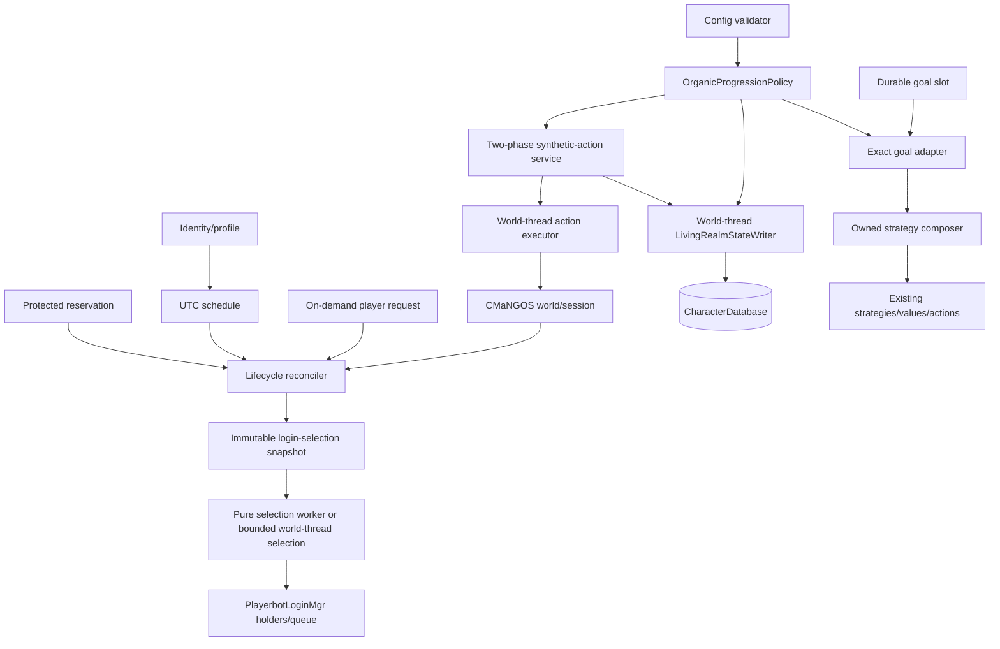

# Living Realm: persistent Playerbot population architecture

- **Status:** Draft umbrella design
- **Implementation readiness:** Phase 0 ready; Living Realm 0.1 ready after
  maintainer approval of designs 0002–0004
- **Classic behavior:** Primary acceptance target
- **Classic/TBC/WotLK compilation:** Required
- **Document version:** 0.3
- **Last updated:** 2026-07-13
- **Reviewed Playerbots baseline:**
  `cmangos/playerbots@92f12098dc8c5c25ef268f89cac0f43c6ca55d4b`
- **Reviewed CMaNGOS Classic baseline:**
  `cmangos/mangos-classic@de8f72993b9e1faa1bf92dd5505f3daec5cea3ce`
- **Reviewed CMaNGOS TBC baseline:**
  `cmangos/mangos-tbc@e107b53c175e47d7e5b3496181353f5a6349be43`
- **Reviewed CMaNGOS WotLK baseline:**
  `cmangos/mangos-wotlk@57a34d33fb8cb1822258c690c583cc9be8d04708`

## 1. Purpose

Playerbots already executes combat, questing, travel, vendors, trainers, mail,
banks, Auction House actions, groups, guilds, battlegrounds, and controlled
alternate characters. Living Realm adds durable answers to four questions
without replacing that execution engine:

1. who the character is;
2. when it should be online;
3. what exact goal it is pursuing; and
4. which existing Playerbots strategies may execute that intent.

The first profile is **Organic Realm**: newly managed bots begin at the core's
normal starting level, progress through ordinary game mechanics, retain
schedules and goals across restarts, and never silently fall back to legacy
fabrication.

## 2. Confirmed constraints

- `PlayerbotLoginMgr` keeps `OFFLINE`, `ON_LOGINQUEUE`, `ONLINE`, and
  `ON_LOGOUTQUEUE` in memory. Queue states are attempts, not durable completion.
- `AiPlayerbot.AsyncBotLogin` is false by default. Without an explicit Organic
  requirement, legacy `AddRandomBots`/`ProcessBot` remains the active login and
  rotation path.
- Legacy population rotation uses `add`, `logout`, `login`, `update`,
  `randomize`, and `teleport` rows in `ai_playerbot_random_bots`.
- Live CMaNGOS player/session state ultimately determines whether a bot is
  online. `characters.online`, queue state, and legacy events are hints.
- CMaNGOS's normal database transaction API buffers writes and usually hands
  them to a delay thread. Reads execute on separate query connections.
  `SELECT ... FOR UPDATE` and result-returning statements cannot be assumed to
  participate in those buffered transactions.
- `CommitTransactionDirect` exists for synchronous execution, but no current API
  provides affected-row compare-and-swap semantics.
- `PlayerbotFactory::Randomize` and related maintenance paths can synthesize or
  reset levels, XP, quests, spells, inventory, skills, equipment, consumables,
  money, taxi nodes, mounts, pets, reputations, guilds, and arena state.
- Strategy state is a flat mutable set; resets reconstruct defaults and may load
  flat presets. Some strategies add subordinate strategies transitively.
- `TravelMgr` has typed destinations and strict focus-quest filtering, which can
  be reused by exact goal adapters.
- Current route selection does not expose a transport-link capability mask.
- Auction actions use normal session handlers but serialize through the
  module-level `m_ahActionMutex` and may inspect many listings.
- The module CMake file enumerates known source directories; new directories and
  host-side tests require explicit build-system additions.

## 3. Architectural invariants

1. Existing Playerbots remains the moment-to-moment executor.
2. Live world/session state is authoritative; persisted state expresses desire,
   ownership, and history.
3. All critical Living Realm state transitions have one in-process writer owned
   by the world thread.
4. Organic safety is enforced by a central policy boundary, not only a config
   combination.
5. Organic mode fails closed and MUST NOT fall back to legacy behavior.
6. Database writes and world mutations do not claim cross-domain atomicity or
   exactly-once execution.
7. A synthetic world mutation MUST NOT run until its `REQUESTED` record is
   synchronously durable and verified.
8. Workers receive immutable snapshots and return generation-checked proposals;
   live `Player`, `Group`, `Map`, `TravelTarget`, `Item`, and quest-state objects
   remain on the world thread.
9. Goals, commitments, safety, operator intent, and future encounter behavior
   compose through owned layers; no owner removes behavior required by another.
10. Player-owned alternate bots are excluded unless separately enabled.
11. LLM output is never authoritative for movement, combat, spending, inventory,
    quests, groups, or progression.
12. Test-only fixture bots are not Organic characters and cannot enter the
    production population, economy, provenance, or fairness accounting.

## 4. Sources of truth

| Concern | Authority | Durable advisory state | Never authoritative alone |
|---|---|---|---|
| Online/offline | Live CMaNGOS player/session | Desired schedule state | `characters.online`, queue state, legacy events |
| Character identity | Current low `characters.guid` + Living Realm identity nonce | Account/race/class fingerprint and retired history | Raw `ObjectGuid` in generic stores |
| Group membership | Live CMaNGOS `Group` | Reservation/commitment lease | Prior group event |
| Quest progress | CMaNGOS quest state and objective counters | Goal target/phase and quest-state fingerprint | Persisted phase |
| Strategies active | Effective engine strategy set | Owned directives by layer | Prior "overlay applied" event |
| Synthetic result | Observed action-specific postcondition + audit reconciliation | Requested/expected state | `REQUESTED` row |
| Login eligibility | Reconciled immutable snapshot | Schedule/request/commitment desire | Config token alone |
| Population reset | Managed global operation state | Per-character retirement records | Raw SQL script execution |

Events are hints and telemetry. Startup and periodic reconciliation inspect
authoritative state.

## 5. Policy precedence

The first applicable rule wins. Designs 0003 and 0004 MUST use this exact order:

1. CMaNGOS legality and immediate safety;
2. Organic progression policy;
3. protected real-player commitment;
4. active encounter assignment (future);
5. active group/reservation commitment;
6. mandatory survival or ordinary maintenance prerequisite;
7. schedule wind-down;
8. current durable personal goal;
9. Population Director recommendation (0.2);
10. legal user/preset directives;
11. base/class behavior and bounded ambient RPG behavior.

An authenticated operator may replace a goal or schedule, but cannot bypass core
legality or Organic policy. A progression-bypassing operator action is an
explicit administrative synthetic action and requires a named policy
classification and action-specific audit reconciler. Ordinary player chat cannot
disable Organic policy.

## 6. System boundary

0.1 components are config validation, single-writer persistence, policy, audit,
identity/profile, UTC schedule, lifecycle reconciliation, managed reset,
protected commitments, modeled public-transport compatibility, five goal
adapters, bounded ambient quest intake, a durable primary-goal slot, and the
minimum overlay foundation. 0.2 adds a utility planner, Population Director,
measurable fairness, formal activity classifications, and backpressure.

## 7. Release boundaries

### Phase 0

- enumerate every synthetic mutation, shortcut, login path, and state-changing
  maintenance path;
- introduce a guarded host-side test target and retain the existing in-world
  scenario DSL for integration tests;
- add policy-decision tests, deterministic clock/nonce providers, fault-injection
  seams, and fixture-bot isolation;
- define migration/version detection and the single-writer persistence seam;
- instrument existing login/logout, group, travel, quest, mutation, and
  performance observations through a replaceable telemetry sink;
- add schedule/goal transition events only when those 0.1 components exist;
- capture baseline CPU, database, login, travel, activity, and quest-progress
  metrics;
- compare the exact-quest/no-progress and activity-scaling ideas documented in
  0006 without importing WotLK-specific authority.

### Living Realm 0.1

- fail-closed Organic profile and startup policy report;
- `AiPlayerbot.AsyncBotLogin=1` as a validated requirement;
- managed identities excluded from legacy login rotation and legacy
  `add`/`logout` lifecycle timers;
- fresh managed Organic population provenance and managed reset/recreate flow;
- single-writer persistence with synchronous durability for critical transitions;
- two-phase synthetic-action audit and restart reconciliation;
- stable identities/profiles and UTC schedules;
- schedule-aware login eligibility, safe wind-down, on-demand real-player
  requests, and protected commitments;
- exactly five goals: `SAFE_IDLE`, `COMPLETE_QUEST`, `TRAIN_CLASS`,
  `VISIT_VENDOR_OR_REPAIR`, and `PREPARE_LOGOUT`;
- bounded ambient quest acquisition feeding `COMPLETE_QUEST`;
- owner-safe strategy composition foundation and preset isolation;
- modeled, audited canonical public-transport transfers where physical boarding
  is unavailable;
- bounded, audited stuck recovery;
- fault-injection coverage.

### Living Realm 0.2

- general utility planner;
- complete owned-overlay recomposition;
- Population Director with virtual-runtime fairness;
- role/zone recommendations, load budgets, and backpressure;
- measured foreground/background classifications.

Economy, relationships, bot-only dungeon assembly, encounter rules, dialogue,
and administration are later child designs. Fixture bots, raid encounter
references, and addon workflows from mod-playerbots are informative inputs, not
0.1 runtime dependencies.

## 8. Authoritative child designs

- 0001A defines code baselines, the persistence contract, build/test additions,
  requirements, risks, and readiness.
- 0002/0002A/0002B/0002C define Organic classifications, durable audit,
  public-transport compatibility, and stuck recovery.
- 0003/0003A define identity, schedules, login integration, managed reset,
  commitments, schemas, and startup reconciliation.
- 0004/0004A define exact goals, ambient quest intake, and overlay ownership.
- 0005/0005A define 0.2 population selection and performance.
- 0006 is informative and cannot weaken any Organic invariant.
