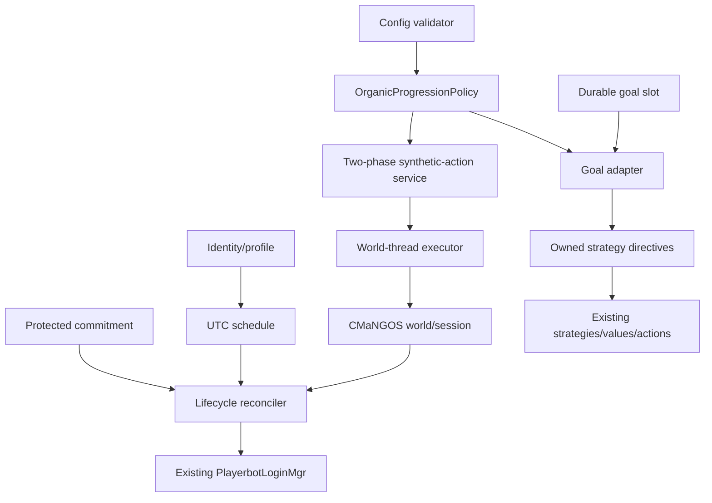

# Living Realm: persistent Playerbot population architecture

- **Status:** Draft umbrella design
- **Implementation readiness:** Phase 0 and Living Realm 0.1 after review of designs 0002–0004
- **Classic behavior:** Primary acceptance target
- **Classic/TBC/WotLK compilation:** Required
- **Document version:** 0.2
- **Last updated:** 2026-07-13
- **Reviewed Playerbots baseline:** `cmangos/playerbots@92f12098dc8c5c25ef268f89cac0f43c6ca55d4b`

## 1. Purpose

Playerbots already executes combat, questing, travel, vendors, trainers, mail, banks, Auction House actions, groups, guilds, battlegrounds, and controlled alternate characters. Living Realm adds durable answers to four questions without replacing that execution engine:

1. who the character is;
2. when it should be online;
3. what exact goal it is pursuing; and
4. which existing Playerbots strategies may execute that intent.

The first profile is **Organic Realm**: newly managed bots begin at the core’s normal starting level, progress through ordinary game mechanics, retain schedules and goals across restarts, and never silently fall back to legacy fabrication.

## 2. Confirmed constraints

- `PlayerbotLoginMgr` keeps `OFFLINE`, `ON_LOGINQUEUE`, `ONLINE`, and `ON_LOGOUTQUEUE` in memory. Queue states are attempts, not durable completion.
- Legacy population rotation uses `add` and `logout` rows in `ai_playerbot_random_bots`.
- Live CMaNGOS player/session state ultimately determines whether a bot is online.
- `PlayerbotFactory::Randomize` can synthesize or reset levels, XP, quests, spells, inventory, skills, equipment, consumables, money, taxi nodes, mounts, pets, reputations, and guild state. Disabling random levels alone is therefore not an Organic policy.
- Strategy state is a flat mutable set; resets reconstruct defaults and may load flat presets.
- `TravelMgr` has typed destinations and focus-quest binding, which can be reused by exact goal adapters.
- Auction actions use normal session handlers but serialize through a global mutex and may inspect many listings.
- SQL transactions cannot atomically include an in-memory world mutation.
- The module CMake file enumerates known source directories; new directories require explicit additions.

## 3. Architectural invariants

1. Existing Playerbots remains the moment-to-moment executor.
2. Live world/session state is authoritative; persisted state expresses desire and history.
3. Organic safety is enforced by a central policy boundary, not only config combinations.
4. Organic mode fails closed and MUST NOT fall back to legacy behavior. Returning to legacy behavior requires an explicit config change and clean restart.
5. Database writes and world mutations do not claim cross-domain atomicity or exactly-once execution.
6. Workers receive immutable snapshots and return generation-checked proposals; world objects remain on the world thread.
7. Goals, commitments, safety, and future encounter behavior compose through owned layers; no owner removes behavior required by another.
8. With `AiPlayerbot.LivingRealm.Enabled = 0`, no new schema, login criterion, policy override, overlay, or runtime mutation is required.
9. Player-owned alternate bots are excluded unless separately enabled.
10. LLM output is never authoritative for movement, combat, spending, inventory, quests, groups, or progression.

## 4. Sources of truth

| Concern | Authority | Durable advisory state | Never authoritative alone |
|---|---|---|---|
| Online/offline | Live CMaNGOS player/session | Desired schedule state | `characters.online`, queue state, legacy events |
| Character identity | Low `characters.guid` + Living Realm identity nonce | Account/race/class fingerprint | Raw `ObjectGuid` in generic stores |
| Group membership | Live CMaNGOS `Group` | Protected commitment lease | Prior group event |
| Quest progress | CMaNGOS quest state | Goal target/phase | Goal phase |
| Strategies active | Effective engine set | Owned layer directives | Prior “overlay applied” event |
| Synthetic result | Observed postcondition + reconciled audit | Requested/expected state | `REQUESTED` row |

Events are hints and telemetry. Startup and periodic reconciliation inspect authoritative state.

## 5. Policy precedence

The first applicable rule wins:

1. CMaNGOS legality and immediate safety;
2. Organic progression policy;
3. protected real-player commitment;
4. active encounter assignment (future);
5. active group/reservation commitment;
6. mandatory survival or maintenance prerequisite;
7. schedule wind-down;
8. current durable personal goal;
9. Population Director recommendation (0.2);
10. ambient RPG behavior.

An authenticated operator may replace a goal or schedule, but cannot bypass core legality. A progression-bypassing operator action is an explicit administrative synthetic action and requires policy classification and audit. Ordinary player chat cannot disable Organic policy.

## 6. System boundary

0.1 components are config validation, policy, audit, identity/profile, UTC schedule, lifecycle reconciliation, protected commitments, five goal adapters, a durable primary-goal slot, and the minimal overlay foundation. 0.2 adds a utility planner, Population Director, measurable fairness, formal activity classifications, and backpressure.

## 7. Release boundaries

### Phase 0

- enumerate every synthetic mutation and shortcut;
- add policy-decision tests and disabled-mode parity fixtures;
- add deterministic clock/nonce providers and fault-injection seams;
- define migration/version detection;
- instrument only login/logout observed, schedule transition, goal transition, group joined/left, travel completed/failed, quest accepted/rewarded, and synthetic action phase events;
- capture baseline CPU, database, login, and activity metrics.

### Living Realm 0.1

- fail-closed Organic profile and startup policy report;
- fresh managed Organic population provenance;
- two-phase synthetic-action audit and restart reconciliation;
- stable identities/profiles and UTC schedules;
- schedule-aware login eligibility, safe wind-down, and protected real-player commitments;
- exactly five goals: `SAFE_IDLE`, `COMPLETE_QUEST`, `TRAIN_CLASS`, `VISIT_VENDOR_OR_REPAIR`, `PREPARE_LOGOUT`;
- owner-safe strategy composition foundation;
- no autonomous transport shortcut;
- disabled-mode parity and fault-injection coverage.

### Living Realm 0.2

- general utility planner;
- complete owned overlay recomposition;
- Population Director with virtual-runtime fairness;
- role/zone recommendations, load budgets, and backpressure;
- measured foreground/background classifications.

Economy, relationships, bot-only dungeon assembly, encounter rules, dialogue, and administration are later child designs.

## 8. Implementation contract and readiness

Transport, persistence, build, assumptions, risks, traceability, and readiness are normative in [the 0001 implementation contract](0001-living-realm-implementation-contract.md).
