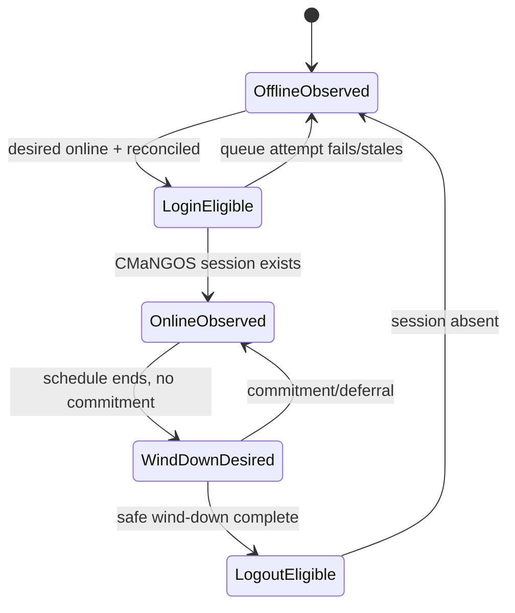

# Living Realm 0003: lifecycle persistence and reconciliation

- **Status:** Draft authoritative child design
- **Target:** Living Realm 0.1
- **Depends on:** [0001](0001-living-realm.md), [0002](0002-organic-policy-and-audit.md)
- **Schema/reconciliation appendix:** [0003A](0003-lifecycle-schema-and-reconciliation.md)

## 1. Authoritative lifecycle model

There is one lifecycle truth: **actual CMaNGOS world/session state**. Living Realm persists desired schedule state, identity, and commitments. Login/logout queue states are ephemeral attempts. `characters.online` and legacy `add`/`logout` events are not completion proof.

Organic mode does not use legacy `add`/`logout` events as lifecycle authority. The login manager receives an Organic eligibility criterion from the reconciler; existing queues and holders still perform actual login/logout. Persisted transitional states are never interpreted as proof that those operations completed.

Durable schedule values are `desired_online`, window boundaries, wind-down request, and reconciliation metadata—not queue states.

## 2. Identity and provenance

New tables identify a character by `uint32 characters.guid` plus `BINARY(16) identity_nonce`. The nonce is generated once by a portable cryptographically strong provider when the managed character root is created. Child rows carry both values.

0.1 requires fresh managed provenance:

- `BootstrapPolicy=require_fresh` is mandatory;
- bot creation creates the character and root/nonce through one managed workflow;
- legacy random bots without `ORGANIC_CREATED` provenance block strict startup until reset/recreated;
- deletion/reset retires the old root and child rows transactionally, records the operation, and gives recreated characters a new nonce;
- account/race/class fingerprints detect unsupported external edits but do not replace the nonce;
- imports/direct DB edits that bypass hooks quarantine ambiguous characters.

Stable profile traits are generated deterministically from a profile seed stored at creation. Profile changes are versioned and do not reroll silently.

## 3. UTC schedule model

0.1 uses **UTC epoch milliseconds only**. Named timezones and DST are future work. A stable archetype and seed generate weekly candidate windows; session jitter is deterministic for `(identity_nonce, schedule_generation, window_start)` so restarts do not reroll the same window.

Schedule state stores current/next window, desired online value, wind-down deadline, generation, and last reconciliation. Realm downtime does not grant progression. On restart, expired windows are skipped; a current window may make the bot eligible after reconciliation. Cohorts stagger first activation without changing starting level.

Default archetypes (casual, regular, weekend, hardcore, crafter/PvP later) are data, not separate code paths. Exact weights/session lengths remain implementation-time config within documented bounds.

## 4. Startup order

When Organic mode is enabled:

1. validate config/profile and required schema version;
2. verify migration state is clean;
3. load managed roots and validate identity/provenance;
4. load/validate profiles, schedules, goals, and commitments;
5. reconcile incomplete audit actions;
6. inspect actual sessions/players and persisted locations;
7. reconcile each character deterministically;
8. quarantine per-character errors; block globally on global prerequisite failure;
9. only then expose reconciled eligibility to `PlayerbotLoginMgr`.

No managed random bot enters the login queue before this sequence succeeds.

## 5. Safe wind-down

When a schedule ends, Living Realm sets durable wind-down intent and activates `PREPARE_LOGOUT`; it does not queue immediate logout.

Deferral is mandatory while the bot is in combat, dead with recovery in progress, in a protected real-player commitment, instance/BG/arena, trade/mail/AH transaction, taxi/transport transition, pending group acceptance, or an unsafe core state. Wind-down performs bounded ordinary actions: finish combat, avoid new long work, repair/vendor/mail when useful and reachable, move to a supported safe location, save normally, then become logout-eligible.

A maximum deferral produces diagnostics but never tears down a protected real-player group. An authenticated operator may explicitly revoke a commitment; ordinary schedule expiry cannot.

## 6. Protected real-player commitments

A durable commitment lease is created only after live group membership with a real player is observed and accepted. It protects random bots from schedule logout and 0.2 population replacement.

Multiple-player policy:

- one active commitment slot per bot;
- an owned-alt account master has priority when owned alts are explicitly enabled;
- otherwise first accepted real-player owner wins;
- later requests do not steal the bot and receive a deterministic busy response;
- a bot-only reservation loses to a newly accepted real-player commitment before activity start; after start, transfer follows explicit policy and safe boundary;
- owner disconnect starts a grace period; another real player already in the same group may acquire ownership deterministically by earliest join time then low GUID;
- transfer/release uses row locking and a new lease token;
- expiry never proves group departure; live group state is authoritative.

## 7. Login manager integration

`PlayerbotLoginMgr` continues to own holders and queue transitions. Proposed Organic criterion checks:

- managed root/profile/schedule valid;
- not quarantined;
- desired online or protected commitment;
- current capacity available;
- audit/lifecycle reconciliation complete;
- no stale lease/identity mismatch.

Queueing login/logout does not update durable “actual” state. Observed login/logout callbacks update reconciliation timestamps and metrics. Failed attempts return to observed state and retry within bounded backoff.

## 8. Failure behavior

| Failure | Result |
|---|---|
| Unknown/missing schema, dirty migration, global reconciliation failure | Block all managed bot startup |
| Missing/malformed root/profile/schedule | Quarantine that bot and keep offline |
| Actual online but desired offline | Wind down unless protected; never assume persisted logout completed |
| Actual offline but desired online | Mark eligible if all guards pass |
| Audit ambiguity | Quarantine until action-specific reconciliation resolves |
| Commitment row disagrees with live group | Live group wins; repair/expire row deterministically |
| DB unavailable during transition | Keep current safe actual state, defer new queue operation, emit health failure |
| Worker unavailable | Deterministic world-thread fallback/safe idle; no legacy randomization |

## 9. Cleanup and retention

Managed character deletion and population reset delete/retire schedules, goals, overlays, and commitments in a transaction and retain audit history according to 0002. Orphan jobs verify identity nonce and root state before cleanup. Expired commitments/goals become terminal before retention. Guild deletion clears only future guild-specific rows; it cannot delete character identity. Failed migrations remain marked dirty and block Organic startup; no automatic down-migration is promised.

## 10. Acceptance tests

Tests cover identity creation/reuse/mismatch, fresh bootstrap, deterministic UTC windows, downtime, queue attempts, actual/desire combinations, safe wind-down deferrals, two real players competing, owner disconnect/transfer, stale commitments, instance/BG restart, character save failure, DB outage, duplicate events, malformed rows, partial migration, restart at every transition, and disabled-mode parity. Acceptance requires every startup-matrix row to have deterministic behavior and no persisted queue state to be treated as actual state.
