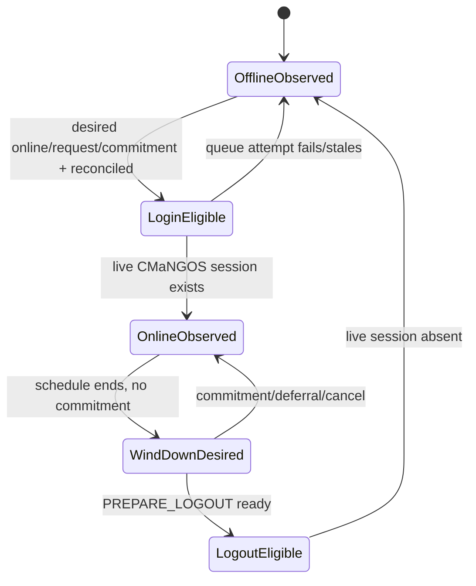

# Living Realm 0003: lifecycle persistence and reconciliation

- **Status:** Draft authoritative child design
- **Target:** Living Realm 0.1
- **Depends on:** [0001](0001-living-realm.md),
  [0002](0002-organic-policy-and-audit.md)
- **Schema/reconciliation appendix:**
  [0003A](0003-lifecycle-schema-and-reconciliation.md)

## 1. Authoritative lifecycle model

There is one lifecycle truth: **actual CMaNGOS world/session state**. Living
Realm persists desired schedule state, identity, requests, and commitments.
Login/logout queue states are ephemeral attempts. `characters.online` and legacy
`add`/`logout` events are not completion proof.

Organic 0.1 requires `AiPlayerbot.AsyncBotLogin=1`. Managed identities do not use
legacy `AddRandomBots`/`ProcessBot` selection or legacy `add`/`logout` timers.
The existing `PlayerbotLoginMgr` holder/login machinery is retained only after
the snapshot and managed-path corrections in section 8.

Mixed managed and legacy random bots under one configured random-bot account
prefix are unsupported in 0.1 and block strict startup.



Durable schedule values are `desired_online`, window boundaries, wind-down
request, and reconciliation metadata—not queue states.

## 2. Identity and provenance

New tables identify a character by `uint32 characters.guid` plus `BINARY(16)
identity_nonce`. The nonce is generated once by a portable cryptographically
strong provider when the current managed root is created. Child rows carry both
values.

0.1 requires fresh managed provenance:

- `BootstrapPolicy=require_fresh` is mandatory;
- bot creation uses the normal core creation path, then directly commits the
  current root/nonce before the character becomes login-eligible;
- legacy random bots without `ORGANIC_CREATED` provenance block strict startup
  until the managed reset/recreate operation completes;
- deletion moves the current root to identity history, terminalizes child state,
  and preserves audit history;
- a recreated character receives a new nonce even if CMaNGOS reuses the low GUID;
- account/race/class fingerprints detect unsupported external edits but do not
  replace the nonce;
- imports/direct DB edits that bypass hooks quarantine ambiguous characters.

Stable profile traits are generated deterministically from a profile seed stored
at creation. Profile changes are versioned and do not reroll silently.

## 3. UTC schedule model

0.1 uses **UTC epoch milliseconds only**. Named timezones and DST are future
work. A stable archetype and seed generate weekly candidate windows; session
jitter is deterministic for `(identity_nonce, schedule_generation,
window_start)` so restarts do not reroll the same window.

Hard validation bounds for 0.1:

- session duration: 15 minutes to 8 hours;
- no more than 14 candidate windows per UTC week;
- deterministic start jitter: at most 30 minutes;
- minimum offline interval between ordinary windows: 15 minutes;
- wind-down lead/deadline: 1 to 60 minutes;
- no schedule may create material offline progression.

Defaults and archetype weights are selected after Phase 0 measurement but MUST
remain inside these bounds unless this design is revised.

On restart, expired windows are skipped. A current window may make the bot
eligible after reconciliation. Cohorts stagger first activation without changing
starting level.

## 4. Startup order

When Organic mode is enabled:

1. validate profile, `AsyncBotLogin=1`, incompatible legacy settings, and required
   schema version;
2. verify migration and global managed-operation state are clean;
3. load managed current roots and validate identity/provenance;
4. detect mixed/unmanaged prefix characters and raw-reset damage;
5. load and validate profiles, schedules, goals, and reservations;
6. reconcile incomplete audit actions;
7. inspect actual sessions/players and persisted locations;
8. reconcile each character deterministically;
9. quarantine per-character errors; block globally on global prerequisite failure;
10. publish immutable login-selection snapshots;
11. only then permit managed queue attempts.

No managed random bot enters any login path before this sequence succeeds.

## 5. Safe wind-down

When a schedule ends, Living Realm sets durable wind-down intent and activates
`PREPARE_LOGOUT`; it does not queue immediate logout.

Deferral is mandatory while the bot is in combat, dead with recovery in progress,
in a protected real-player commitment, instance/BG/arena, trade/mail/AH
transaction, taxi/transport transition, pending group acceptance, or an unsafe
core state.

Wind-down performs bounded ordinary actions: finish combat, avoid new long work,
repair/vendor/mail when useful and reachable, move to a supported safe location,
submit normal character persistence, then become logout-eligible. Persistence
submission is not treated as durable completion; actual logout and restart
reconciliation provide the durable observation.

A maximum deferral produces diagnostics but never tears down a protected
real-player group. An authenticated operator may explicitly revoke a commitment;
ordinary schedule expiry cannot.

## 6. Real-player requests and protected commitments

A **protected commitment** is an active
`ai_playerbot_living_reservation` with
`reservation_type='REAL_PLAYER_COMMITMENT'` and
`protected_real_player=1`.

An offline managed bot may receive an on-demand request through an explicit
Living Realm request API or playerbot command. The request:

- is persisted as `REAL_PLAYER_REQUEST`;
- is subject to identity, policy, capacity, class/faction, quarantine, and route
  checks;
- may override an ordinary schedule window when
  `AllowOnDemandOutsideSchedule=1` (default for a private realm);
- has a bounded TTL;
- does not become protected until live group membership with the requesting real
  player is observed and accepted;
- never creates a legacy `add` timer.

Multiple-player policy:

- one active request/commitment slot per bot;
- an account owner has priority only when owned alts are explicitly enabled;
- otherwise first accepted real-player owner wins;
- later requests do not steal the bot and receive a deterministic busy response;
- a bot-only reservation loses to a newly accepted real-player commitment before
  activity start; after start, transfer follows explicit safe-boundary policy;
- owner disconnect starts a grace period;
- another real player already in the same group may acquire ownership by earliest
  observed join time, then low GUID;
- the world-thread reconciler renews a live commitment every 30 seconds by
  default, within a permitted 10–60 second interval;
- lease duration defaults to 120 seconds, bounded to 60–300 seconds;
- expiry never proves group departure; live group state is authoritative.

## 7. Managed reset and bootstrap operation

Organic 0.1 provides a managed, resumable operation rather than relying on raw
SQL scripts.

Proposed console flow:

```text
rndbot living reset-plan
rndbot living reset-apply <operation-token>
rndbot living reset-status
```

The operation:

1. directly records global state `REQUESTED`;
2. blocks managed login and waits for safe bot logout;
3. enumerates accounts by the configured random-bot prefix in LoginDatabase;
4. retires current identity roots and terminalizes child rows in
   CharacterDatabase;
5. invokes normal account/character deletion/recreation paths;
6. creates new characters through the normal core path;
7. directly creates new roots/nonces/profiles/schedules;
8. verifies the complete population and marks the operation `COMPLETED`.

LoginDatabase and CharacterDatabase cannot commit atomically. The operation is
idempotent and phase-based. Orphan accounts may be reused or removed on retry;
characters without roots and roots without characters block login and are
repaired or retired deterministically.

`sql/other/delete_randombots.sql` and `reset_randombots.sql` are deprecated and
unsupported after Organic is enabled. Startup detects their characteristic
partial state and blocks until a managed reset repairs it.

## 8. Login-manager integration and thread ownership

`PlayerbotLoginMgr` continues to own query holders and actual login/logout queue
transitions, with these required changes:

1. startup refuses Organic managed bots unless `AsyncBotLogin=1`;
2. legacy `AddRandomBots`, legacy `ProcessBot`, and legacy timed-rotation
   callbacks skip every managed identity;
3. managed login/logout callbacks do not write `add` or `logout` events;
4. a mandatory `OrganicEligibility` predicate is applied in code and cannot be
   removed by `DefaultLoginCriteria` configuration;
5. ordinary capacity/class/level criteria may rank or limit an already eligible
   candidate, but `offline`/`logoff` legacy event criteria are not applied to
   managed identities;
6. the world thread builds immutable POD `LoginSelectionSnapshot` objects;
7. any `std::async` selection task receives only those snapshots and config
   constants—no `Player*`, `Group*`, database calls, `eventCache`, or mutable
   `botPool`;
8. the worker returns GUID/nonce decisions only;
9. the world thread revalidates snapshot generation and actual state before
   mutating queue state or sending holders.

An implementation may instead perform bounded selection synchronously on the
world thread, but it may not retain the current shared-mutable/off-thread
behavior for Organic decisions.

Queueing login/logout does not update durable actual state. Observed callbacks
update reconciliation timestamps and metrics. Failed attempts return to observed
state and retry within bounded backoff.

## 9. Failure behavior

| Failure | Result |
|---|---|
| Unknown/missing schema, dirty migration, global operation incomplete | Block all managed bot startup |
| `AsyncBotLogin=false`, mixed population, or legacy path owns managed bot | Block managed startup |
| Missing/malformed root/profile/schedule | Quarantine bot and keep offline |
| Actual online but desired offline | Wind down unless protected; never assume persisted logout completed |
| Actual offline but desired online/requested | Mark eligible only after all guards |
| Audit ambiguity | Quarantine until action-specific reconciliation resolves |
| Reservation disagrees with live group | Live group wins; repair/expire row deterministically |
| DB unavailable during transition | Keep current safe actual state, defer queue operation |
| Selection worker unavailable | Bounded world-thread selection or hold; no legacy fallback |
| Stale worker result | Discard by snapshot generation/identity/version |
| Managed reset interrupted | Resume operation or block; never fall back to raw reset |

## 10. Cleanup and retention

Managed character deletion moves the current root to history, terminalizes
schedules, goals, overlays, requests, and reservations, and retains audit history
under 0002B. Orphan jobs verify nonce and current-root state before cleanup.
Expired commitments/goals become terminal before retention. Guild deletion clears
only future guild-specific state; it cannot delete character identity. Failed
migrations remain dirty and block Organic startup; no destructive automatic
down-migration is promised.

## 11. Acceptance tests

Tests cover identity creation/reuse/mismatch, fresh bootstrap, managed reset at
every phase, deterministic UTC windows, downtime, on-demand requests,
`AsyncBotLogin=false`, legacy path suppression, immutable login snapshots,
worker staleness, queue attempts, actual/desire combinations, safe wind-down
deferrals, two real players competing, owner disconnect/transfer, stale
commitments, instance/BG restart, save-submission ambiguity, DB outage,
duplicate events, malformed rows, partial migration, and restart at every
transition.

Acceptance requires every startup-matrix row to have deterministic behavior, no
persisted queue state to be treated as actual state, and no managed identity to
enter the legacy login/rotation path.
